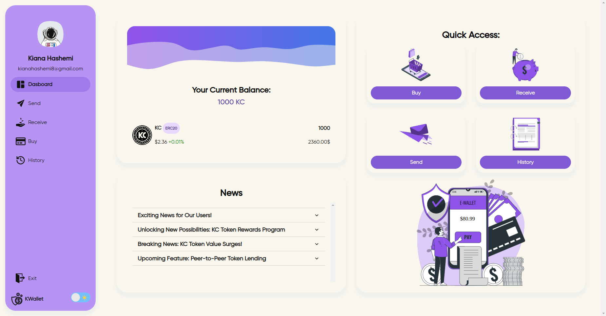

<br/>
<p align="center">
  <h3 align="center">KWallet Frontend</h3>

  <p align="center">
    Welcome to the KWallet Frontend project! This repository contains the frontend component of the KWallet project. The frontend is built using Vite and provides a fully responsive user interface for interacting with the KWallet application.
    <br/>
    <br/>
    <a href="https://kiana8181.github.io/KWallet-frontend/">View Demo(only the user interface)</a>
    .
  </p>
</p>

## Table of Contents

1. [About The Project](#about-the-project)
2. [Features](#features)
3. [Viewing the Frontend Live](#viewing-the-frontend-live)
4. [Related Links](#related-links)
5. [How to Run](#how-to-run)
   - [Prerequisites](#prerequisites)
   - [Installation](#installation)

## About The Project



KWallet is a comprehensive blockchain-based wallet application designed to provide users with a seamless and secure experience for managing digital assets. Built with a modern tech stack, including Hyperledger Fabric for the blockchain, a Go-based backend, and a Vite-powered frontend using React, KWallet offers a robust platform for buying, sending, and receiving coins. The application features a user-friendly interface that includes a home page, login and registration functionality, and a responsive dashboard where users can view their transaction history and perform various wallet operations. KWallet aims to deliver a reliable and efficient solution for digital asset management while ensuring data consistency and real-time updates through its integration with the backend.

<br />
<br />

## Features

- **Home Page:** Welcomes users and provides an overview of the KWallet application.
- **User Authentication:** Secure login and registration system to ensure user data protection.
- **Dashboard:**
  - **Buy Coins:** Enables users to purchase digital coins through a simple and intuitive interface.
  - **Send Coins:** Allows users to send coins to other users quickly and securely.
  - **Receive Coins:** Users can receive coins from others, with real-time updates on transactions.
  - **Transaction History:** Displays a detailed history of all user transactions, including dates, amounts, and transaction statuses.
- **Fully Responsive Design:** Optimized for seamless use across various devices, including desktops, tablets, and mobile phones.
- **Backend Integration:** All parts of the project communicate with the backend to ensure data consistency, secure transactions, and real-time updates.
- **Enhanced User Experience:** Designed with a focus on user-friendliness, ensuring smooth navigation and interaction throughout the application.
- **Blockchain Technology:** Utilizes Hyperledger Fabric for secure and transparent transaction processing.

## Viewing the Frontend Live

If you want to see the front-end section live without connecting to the back-end, i.e., only the user interface, you can visit the repository [KWallet-frontend](https://github.com/Kiana8181/KWallet-frontend) and to see it live, go to [KWallet Frontend Live](https://kiana8181.github.io/KWallet-frontend/).

## Related Links

### Backend Repository
KWallet's backend is implemented in Go. You can find the backend repository here:
[Backend Repository](https://github.com/Kiana8181/erc20-Backend)

<br />

### Blockchain Repository
You can find the KWallet's blockchain repository here:
[Blockchain Repository](https://github.com/Kiana8181/erc20-Blockchain)

<br />

## How to Run

Follow these steps to clone and set up the Makima project on your local machine:

### Prerequisites

Make sure you have the following prerequisites installed on your system:

- node v20.0.0
- npm (Python package manager)

### Installation

1. Clone the Repository

You can clone the repository using either HTTPS or SSH:

**HTTPS:**
```sh
git clone https://github.com/Kiana8181/erc20-Frontend.git
```

**SSH:**
```sh
git clone git@github.com:Kiana8181/erc20-Frontend.git
```

<br/>
<br/>

2. Navigate to the project directory:

```sh
cd erc20-Frontend/
```

<br/>
<br/>

3. Install dependencies:

```sh
npm install
```

<br/>
<br/>

4. Start the development server:

```sh
npm run dev
```
<br/>
<br/>

5. Open your web browser and access the project at `http://localhost:5173`.

That's it! You now have the KWallet Frontend running locally on your machine.

<br/>
<br/>

6. Builds the app for production(optional):

 ```sh
npm run build

```
